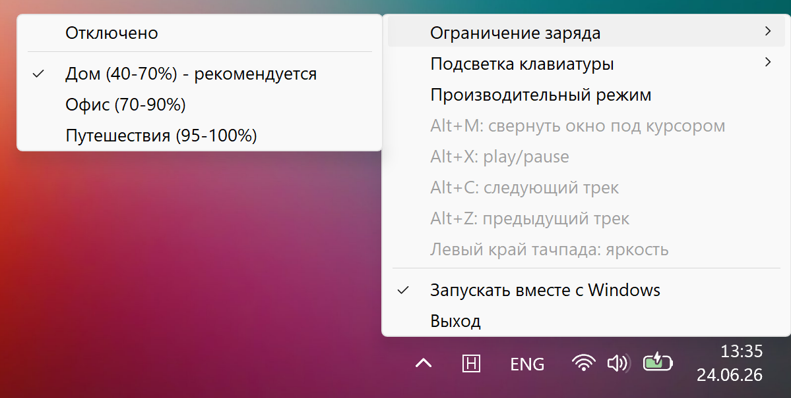

# Honor PC Helper

A Windows system tray utility for managing HONOR laptop hardware features. Uses the official HONOR WMI interface.

## Features

- **Battery** — charge range limiter (extends battery lifespan)
- **Keyboard backlight** — on/off, timeout, and auto-enable schedule
- **Performance** — switch between balanced and performance mode
- **Monitoring** — view temperatures, fan speeds, and hardware settings in the tray tooltip
- **Touchpad** — adjust brightness by swiping the left edge
- **Hotkeys** — global shortcuts for window and media control
- **Autostart** — launches with Windows

## Screenshot



## Usage

Download `HonorPCHelper.exe` from the [latest release](https://github.com/Wintego/honor-pc-helper/releases/latest) and run it. No installation required.

The first time you change a hardware setting, Windows will ask for administrator privileges to create a scheduled task.

Requires **Windows x64**. Feature availability depends on the HONOR laptop model.

## Building from source

Requires [.NET 10 SDK](https://dotnet.microsoft.com/download/dotnet/10.0):

```powershell
.\build.ps1
```

The output file will be placed in `dist\HonorPCHelper.exe`.
